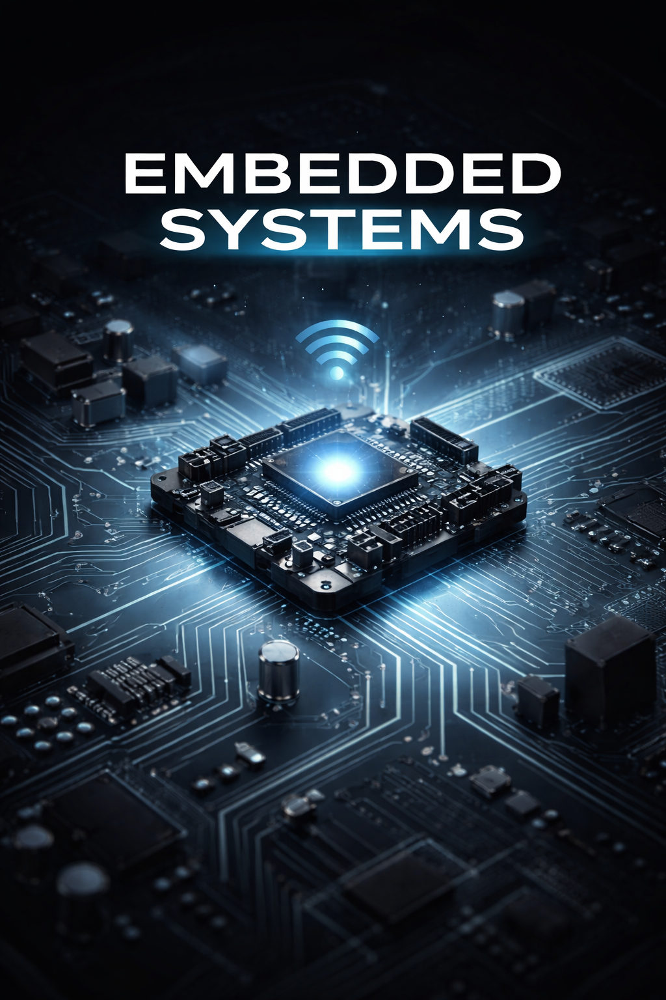

<h1 align="center">Carlos Pérez Rico</h1>

Embedded Systems Engineer | FPGA | RTOS | Satellite Communication

  

---

## 👨‍💻 About Me

Embedded Systems Engineer focused on **low-level programming, digital hardware design, and real-time systems**.

I have experience developing systems that integrate **microcontrollers, FPGA, sensors, and communication protocols**, with emphasis on **real-time processing and embedded architectures**.

---

## 🛠 Technical Experience

- **Microcontrollers:** Tiva C, STM32  
- **Embedded Platforms:** Raspberry Pi  
- **Digital Design:** FPGA (VHDL)  
- **Communication Protocols:** I2C, SPI, UART, CAN  
- **Operating Systems:** RTOS  
- **Applications:** Sensor interfacing, real-time processing, and embedded communication systems  

---

## 🛰 Current Project

Currently developing a **communication system for a satellite mission**, where **three shuttles send telemetry data from their satellites to a central node**.

The system receives the information and forwards it to another subsystem responsible for **transmitting the data to Earth**.

I am also responsible for implementing:

- **Telemetry processing**
- **Command transmission**
- **Communication management between subsystems**

---

## 🎯 Interests

- Embedded Systems  
- Real-Time Systems  
- Sensor Integration  
- Communication Systems  
- Digital Hardware Design  

---

## ⚙️ Technologies

---

This GitHub contains projects related to **embedded systems, hardware interfacing, communication protocols, and digital design**.
